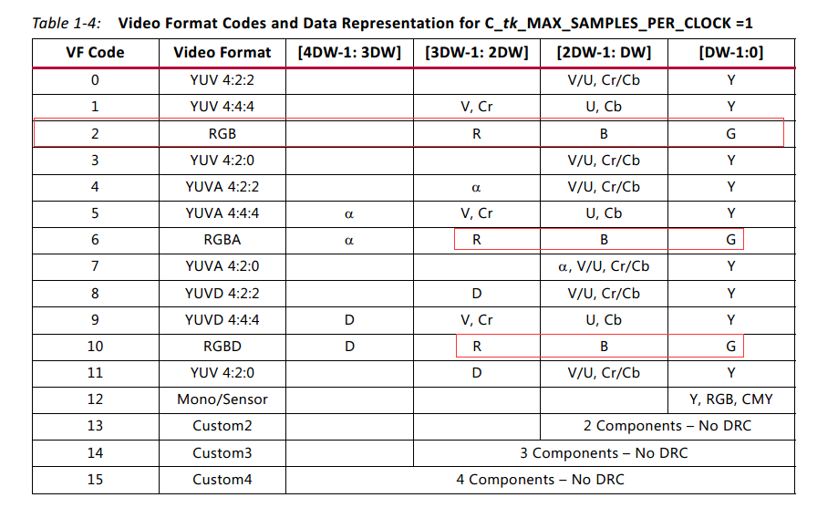

# play_zynq

## 1. tpg_hdmi, done

simply generates test patterns and directly output to himi-tx convertion chip on AX7021. tpg config as 1080p(osd moving box), vtc config as 1080p60.

在AX7021开发板，产生测试图样，直接输出到hdmi。tpg配置为1080p彩条叠加移动box，vtc配置为重建1080p60时序。

## 2. tpg_vdma_hdmi, done

On AX7021 board， generates 1080p test patterns and buffered to ddr by vdma, then output to hdmi.

在AX7021开发板，产生1080p测试图样，通过vdma缓存到ddr，然后输出到hdmi。

## 3. ov5640_vdma_hdmi, done

On AX7021 board, a single OV5640 cmos sensor config as RGB565 DVP at resolusion of 1024x768， buffered by vdma， regerates 1024x768@60fps timing then output to hdmi.

在AX7021开发板，接入单个OV5640摄像头，配置为1024x768的RGB565输入，然后通过vdma缓存之后重建1024x768@60fps时序输出到hdmi。

## 4. ov5640_tpg_vdma_hdmi， done

Base on ov5640_vdma_hdmi project， add a tpg config as 1024x768, swich axi4-stream path by a 2-1 axis_swich.

在ov5640_vdma_hdmi基础上，添加一个1024x768的tpg源，通过axis_swich切换通路。

## 5. ov5640 config study

#### 首先分析PLL配置,如图

input clock =24Mhz, PCLK = 72Mhz

0x3037[3:0]='d3,

24MHz/3 = 8MHz

0x3037[7]='b0,

0x3036[6:0]='d90,

0x3037[7] ? 0x3036[7:1]*2 : 0x3036[6:0]

8MHz * 90 = 720MHz

0x3035[7:4]='d1,

keeps 720MHz

0x3037[4]='b1

720MHz /2 = 360MHz

0x3034[3:0]=0xA

360MHz /2.5 = 144MHz

0x3108[5:4]=0

keeps 144MHz

0x300e[7:5]='d2

0x3035[3:0]=1

144MHz /2=72MHz

0x460c[1]='b1

0x3824[4:0]='d2

keeps 72MHz

#### 然后分析PCLK和分辨率帧率

physical pixel size(active array size)：2592x1944

ISP window是2623x1943

0x3800=0x00,0x3801=0x00

X_ADDR_ST=0

0x3802=0x00,0x3803=0x04

Y_ADDR_ST=4

0x3010=0x00,0x3811=0x10

X_OFFSET=10

0x3012=0x00,0x3813=0x06

Y_OFFSET=6

0x3804=0x0a,0x3805=0x3f

X_ADDR_END=2623

0x3806=0x07,0x3807=0x9b

Y_ADDR_END=1947

data out size是1024x768

这里demo的有效分辨率1024x768, 总的timing size是2570x980，由于2pclk对应一个pixel

所以timing window是1285x980

摄像头配置帧率是fps=72000000/（2570x980）=28.59，还不到30fps

#### 配置一个 1024x768 的 RAW DVP-10 输入

raw_ov5640_colorbar_vdma_hdmi

这个工程是1024x768@50fps raw

在针对raw数据使用demosaic或者cfa这样的ip进行插值之后，发现RGB分量顺序的GB分量是反的

经查ug1037，Table 4-9，LSB分量是G，然后是B，R，依次到最高分量

结论，按手册，其实axis都符合这样的定义。这个和 native stream 不太一样，需要注意。

那么推理是在经过 vid_out 转换成 native stream 之后调整分量，不需要在[3DW-1: 2DW] [2DW-1: DW]之间交换。

其次，分量的位宽

这里进去就通过vid_in_axis丢弃低两位，这样axis通路所有分量都是8位宽，省事。

如果非要比如设置10bit分量位宽，那么需要在axis通路留意分量位宽。另外是vid_out_axis设置正确的native分量位宽。否则显示异常。

#### 配置一个 1080p30 的 RAW DVP-10 输入

标准的分辨率和timing是1920x1080-2200x1125

ISP window可以保持2623x1943

data out size 1920x1080

0x3808=0x07

0x3809=0x80

0x380a=0x04

0x380b=0x38

timing window 2500x1280

0x380c=0x09

0x380d=0xc4

0x380e=0x05

0x380f=0x00

pclk=92MHz for raw

0x3036=0x73

keep others

0x3034

0x3035

0x3037

0x3108

...

ref to https://github.com/xenpac/sun4i_csi/blob/master/device/ov5640.c

scale off

0x5001=0x83

0x3814=0x11

0x3815=0x11

0x3821=0x00

0x3618=0x04

0x3612=0x2b

0x3709=0x12

0x370c=0x00

raw_ov5640_colorbar_vdma_hdmi的sdk代码中已经有配置序列了。

## 6. VPSS: CSC, Scale, Deinterlace, PIP

#### tpg_vpss

CSC, Scale, Deinterlace all in one.

vpss full fledged has a buildin vdma!

#### tpg_vpss_csc_only

tpg: 1080p, YUV422

vpss out: 1080p60, RGB888

#### tpg_vpss_scale_only

Select an option:

1. Change TPG background

2. Enable/Disable TPG moving box

3. Change input resolution

4. Change output resolution

5. Show VPSS log

6. AXI4-Stream to Video Out status

z. Display this menu again

Change Background pattern:

1. Horizontal Ramp

2. Vertical Ramp

3. Temporal Ramp

4. Solid Red

5. Solid Blue

6. Solid Green

7. Solid Black

8. Solid White

9. Color Bar

...

#### tpg_vpss_deint_only

The base address used by the DMA engine inside of the VPSS need to be defined before initializing the VPSS
VPSS这玩意这样用需要通过DMA访问DDR，DMA基地址需要被指定。

另外，这一工程使用了tcl脚本工程模式。

## 7. VDMA: Crop, PIP, static TPG

## 8. TPG --> CSI-TX --> CSI-RX

## TODO:
cmos->vid_in->swich->vdma->ddr->resize/crop/pan/etc..->vdma->vid_out on AX7021, todo

cmos->vid_in->isp(here?)->swich->vdma->?->ddr->resize/crop/pan/etc..->vdma->vid_out on AX7021, todo

linux config isp and ....

microblaze implements on Microphase board(Artix-7)

edid
