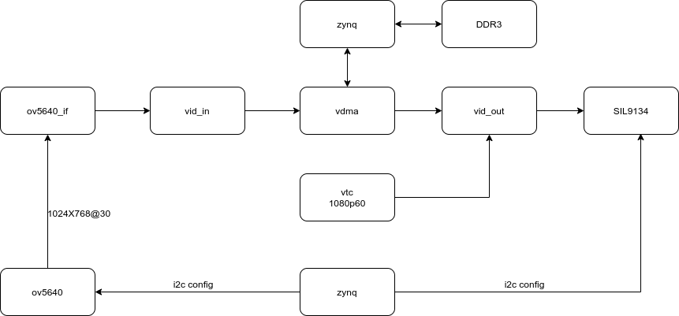

# play_zynq

##1. tpg_hdmi, done
simply generates test patterns and directly output to himi-tx convertion chip on AX7021. tpg config as 1080p(osd moving box), vtc config as 1080p60.
在AX7021开发板，产生测试图样，直接输出到hdmi。tpg配置为1080p彩条叠加移动box，vtc配置为重建1080p60时序。

##2. tpg_vdma_hdmi, done
On AX7021 board， generates 1080p test patterns and buffered to ddr by vdma, then output to hdmi.
在AX7021开发板，产生1080p测试图样，通过vdma缓存到ddr，然后输出到hdmi。

##3. ov5640_vdma_hdmi, done
On AX7021 board, a single OV5640 cmos sensor config as RGB565 DVP at resolusion of 1024x768， buffered by vdma， regerates 1024x768@60fps timing then output to hdmi.
在AX7021开发板，接入单个OV5640摄像头，配置为1024x768的RGB565输入，然后通过vdma缓存之后重建1024x768@60fps时序输出到hdmi。

##4. ov5640_tpg_vdma_hdmi， done
Base on ov5640_vdma_hdmi project， add a tpg config as 1024x768, swich axi4-stream path by a 2-1 axis_swich
在ov5640_vdma_hdmi基础上，添加一个1024x768的tpg源，通过axis_swich切换通路。

##5. ov5640 config study
####首先分析PLL配置,如图

input clock =24Mhz, PCLK = 72Mhz

0x3037[3:0]='d3,   
24MHz/3 = 8MHz

0x3037[7]='b0,
0x3036[6:0]='d90,
0x3037[7] ? 0x3036[7:1]*2 : 0x3036[6:0]
8MHz * 90 = 720MHz

0x3035[7:4]='d1,
keeps 720MHz

0x3037[4]='b1
720MHz /2 = 360MHz

0x3034[3:0]=0xA
360MHz /2.5 = 144MHz

0x3108[5:4]=0
keeps 144MHz

0x300e[7:5]='d2
0x3035[3:0]=1
144MHz /2=72MHz

0x460c[1]='b1
0x3824[4:0]='d2
keeps 72MHz

####然后分析PCLK和分辨率帧率

##TODO:
cmos->vid_in->swich->vdma->ddr->resize/crop/pan/etc..->vdma->vid_out on AX7021, todo

cmos->vid_in->isp(here?)->swich->vdma->?->ddr->resize/crop/pan/etc..->vdma->vid_out on AX7021, todo

linux config isp and ....

microblaze implements on Microphase board(Artix-7)
